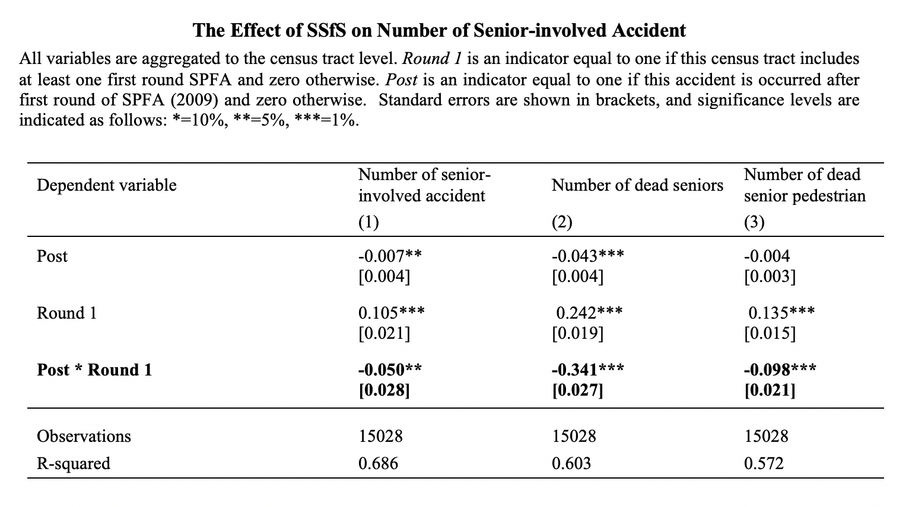

## Senior Pedestrians in NYC: A Diff-in-Diff Approach to Evaluating Safe Streets for Seniors
### Organization: New York Univeristy Center for Urban Science + Progress
### Sponsor: Daniela Hochfellner
### By Pengzi Li, Sam Burns, Po-Yang Kang, Asilayi Bahetibieke
-------------------------------------------------------------------------------------------
**Abstract**

Urban senior populations are expected to grow significantly in the coming decades. This demographic trend requires adjustments to policy and infrastructure in cities. New York City has implemented its Safe Streets for Seniors (SSfS) program, which includes identifying Senior Pedestrian Focus Areas (SPFAs) and making structural improvements designed to improve safety for senior pedestrians to address its aging population. This study investigates whether or not the established SPFAs improved safety for seniors. Using difference-in-difference estimators, we find that setting up SPFA zones in NYC leads to a decrease of about 34 percent in the number of seniors killed in motor vehicle accidents. The number of accidents involving senior pedestrians relative to non-SPFA zones decreased too, however only by 5 percent. Overall, our results show that New York City’s programs addressing senior citizens is successful  and suggest that other cities in the US and abroad should adopt transportation policies similar to NYC’s in order to protect senior citizens.

**URL of our website**:https://agingcapstone.github.io/capstone_site/#connect

----------------------------------------------------------------------------------------------
**Data**

Our diff-in-diff analysis relies primarily on two data sets - traffic fatality data collected from the National Highway Traffic Safety Administration (NHTSA) and SPFA spatial data from NYC DOT. The data can be download through the following links:

**NHTSA traffic fatality data**: ftp://ftp.nhtsa.dot.gov/fars/ 

**SPFA spatial data**: https://data.cityofnewyork.us/Transportation/VZV_Safe-Streets-for-Seniors/bsuh-ywiw

-----------------------------------------------------------------------------------------------
**Result**

-----------------------------------------------------------------------------------------------
**Content**

|Direction                                                 |Corresponding Notebooks                 |Description        
|----------------------------------------------------------|--------------------------------------  |---------------------------|
|**Data cleaning and wrangling**                           |1.1 personClean.ipynb                   |Aggregate the person data into accident level (from one row per person to one row per accident level).|
|                                                          |1.2 accidentClean.ipynb                 |Import yearly accident data and merge them into one dataset.| 
|                                                          |2. mergeClean.ipynb                     |Merge person and accident data into one dataset.|
|                                                          |3. spatialJoinnDescriptiveStats.ipynb   |Merge SPFA spatial data with NHTSA (accident and person) data.|
|**Reorganized dataset for linear regression model**       |4. CensusTractMerge.ipynb               |Reorganized dataset on per census tract level for linear regression model.|
|**Linear regression model and robustness check**          |5.1 Linear_regression.ipynb             |Linear regression model (estimate using 'post' variables (accidents occurred after first round policy implementation).|
|                                                          |5.2 LR_RobustnessCheck.ipynb            |Linear regression model (estimate using yearly variables (accidents occurred every year) for robustness check.|
|**Model visualization**                                   |6. Line_Plots_For_Final_Report.ipynb    |Line plots of three dependent variables to visualize the trend thoughout the years.|
|**Report (Previous progressive reports and final report)**|Report (folder)                         |Our previous progressive report and final report.|
|**Model results and graphs**                              |Results_and_Visualization (folder)      |Figures and tables about th linear regression model in our final report.|

-----------------------------------------------------------------------------------------------------------------------------
**Package Version**:
- python: 3.7.3
- pandas: 0.24.2
- dbfread: 2.0.7
- geopandas: 0.5.0
- shapely: 1.6.4.post2
- fiona: 1.8.4
- matplotlib: 3.0.3
- numpy: 1.16.2
- seaborn: 0.9.0
- requests: 2.22.0
